# Lab 2: Get started with Data Science in Microsoft Fabric

### Estimated Duration: 120 Minutes

## Scenario

At Contoso, the data analytics team is building a machine learning solution to predict customer churn and help the business take proactive retention actions. This lab provides hands-on experience with the end-to-end data analytics workflow in Microsoft Fabric, covering data ingestion into a Lakehouse, model training using scikit learn, and experiment tracking with MLflow. By completing this lab, you will learn how to prepare data, train and compare machine learning models, and manage model outputs within Microsoft Fabric to support smarter, data driven business decisions.

## Overview

In this lab, you will work through a complete end-to-end data science workflow in Microsoft Fabric, from raw data ingestion to model training, experiment tracking, and model preservation. Across eight sequential tasks, you will develop practical skills in data preparation, experiment creation, machine-learning model training, and managing outputs.

## Objectives

In this lab, you will be able to complete the following tasks:

- Task 1: Create a Lakehouse and upload files
- Task 2: Create a Notebook
- Task 3: Load data into a dataframe
- Task 4: Train a Machine Learning model
- Task 5: Use MLflow to search and view your experiments
- Task 6: Explore your experiments
- Task 7: Save the model
- Task 8: Save the Notebook and end the Spark session

## Task 1: Create a Lakehouse and upload files

This task will guide you through setting up a Lakehouse in Microsoft Fabric, where you will upload files for efficient data storage and processing.

Now that you have a workspace, it's time to switch to the *Data science* experience in the portal and create a data lakehouse for the data files you're going to analyze.

1. In the left panel, first click on **dp_fabric-<inject key="Deployment ID" enableCopy="false"/> (1)**, then select **dp_fabric-<inject key="Deployment ID" enableCopy="false"/> (2)** under the Filter by keyword section.

   

1. In the **dp_fabric-<inject key="Deployment ID" enableCopy="false"/>** page, click on **+ New item (1)** and in the search bar serch for **Lakehouse (2)** and select **Lakehouse (3)**.
   
   

   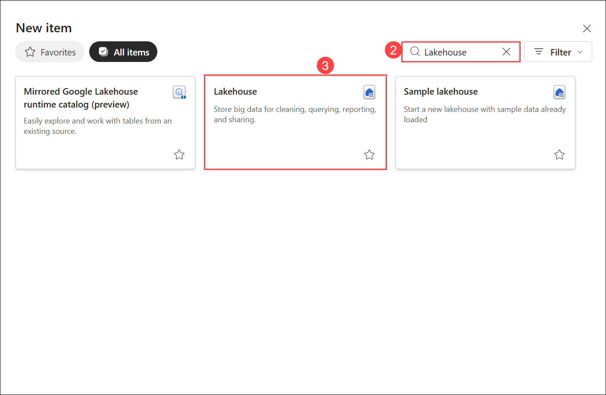

1. In the **New Lakehouse** window, enter **Lakehouse<inject key="Deployment ID" enableCopy="false"/> (1)** as the name, select the **Location** as your workspace **dp_fabric-<inject key="Deployment ID" enableCopy="false"/> (2)** and click **Create (3)**. Keep the Lakehouse schemas unchecked.

    

    >**Note:** After a minute or so, a new lakehouse with no **Tables** or **Files** will be created. You need to ingest some data into the data lakehouse for analysis. There are multiple ways to do this, but in this task, you will simply download and extract a folder of text files from your local computer (or lab VM if applicable) and then upload them to your lakehouse.

1. Return to the web browser tab containing your lakehouse, and under **Get data in your lakehouse**  select **Upload files**.

    

1. Click on the **Browse (1)** option and navigate to **C:\LabFiles\dp-data-main (2)** location. Select the **churn.csv (3)** file, click on **Open (4)** and then **Upload (5)**.

   

1. After the file is **uploaded (1)**, close the tab by clicking **X** **(2)**.

   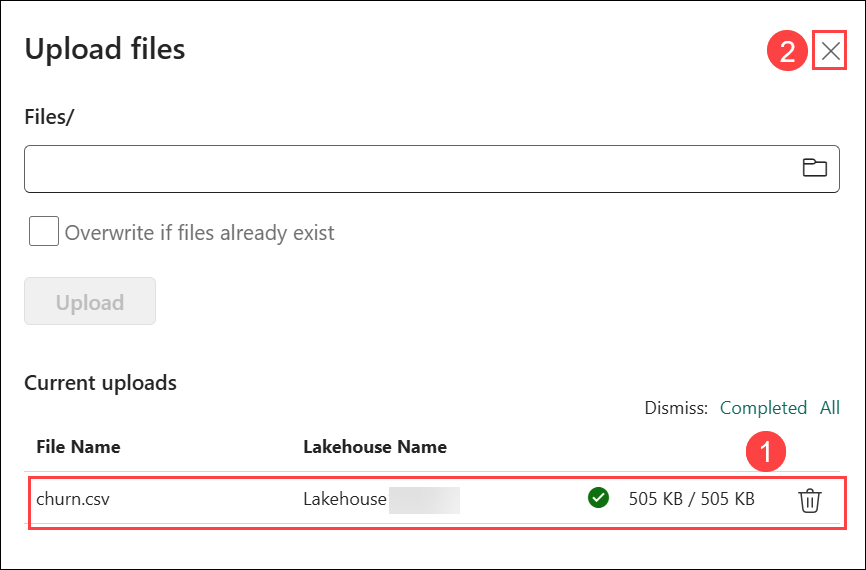

   >**Note:** If you downloaded the file to your own machine, navigate to that location and upload it. 

1. After the file has been uploaded, right-click on **Files (1)** and select **Refresh (2)**, and verify that the **churn.csv (3)** file has been uploaded.

   

## Task 2: Create a Notebook

In this task, you will learn how to create a Notebook in Microsoft Fabric for interactive data exploration and analysis.

To train a model, you can create a *notebook*. Notebooks provide an interactive environment in which you can write and run code (in multiple languages) as *experiments*.

1. In the left panel, first click on **dp_fabric-<inject key="Deployment ID" enableCopy="false"/> (1)**, then select **dp_fabric-<inject key="Deployment ID" enableCopy="false"/> (2)** under the Filter by keyword section.

   

1. In the **dp_fabric-<inject key="Deployment ID" enableCopy="false"/>** page, click on **+ New item (1)** and in the search bar serch for **Notebook (2)** and select **Notebook (3)**. Then click on **Create (4)**.

     

     

     

1. On the pop-up **Notebook Copilot Updates and Git Intergration Supporting Resources** select **Skip for now**.

    

1. Select the first cell (which is currently a *code* cell), and then in the dynamic toolbar at its top-right, use the **M&#8595;** button to convert the cell to a *markdown* cell.

    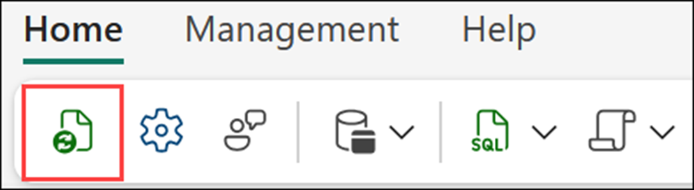

    When the cell changes to a markdown cell, the text it content is rendered.

1. Use the **&#128393;** (Edit) button to switch the cell to editing mode.

   

1. Delete the content and enter the following text:

    ```text
   # Train a machine learning model and track with MLflow

   Use the code in this notebook to train and track models.
    ```

    
    
## Task 3: Load data into a dataframe

You will explore how to import data into a DataFrame in Microsoft Fabric for processing and analysis in this task.

Now you're ready to run code to prepare data and train a model. To work with data, you will use *dataframes*. Dataframes in Spark are similar to Pandas dataframes in Python, and provide a common structure for working with data in rows and columns.

1. Click on **Data items (1)** in the Explorer panel, then select **Add data items (3)** and choose **From OneLake catalog (3)** from the dropdown menu.

   

1. Select the lakehouse you created in a previous section named as **Lakehouse<inject key="Deployment ID" enableCopy="false"/> (1)** and select **ADD (2)**.

   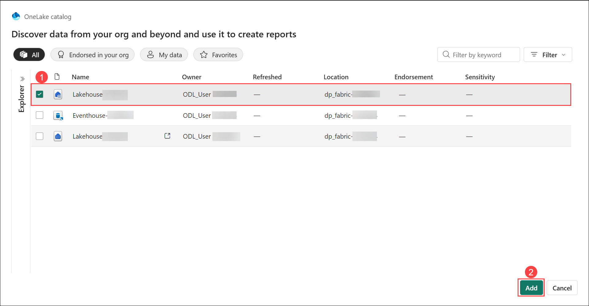

1. Click on the **Files (1)** folder to display the CSV file next to the notebook editor. Then, open the **ellipsis (...)** menu for **churn.csv (2)** and select **Load data (3)** > **Pandas (4)**.

    

1. A new code cell containing the following code should be added to the notebook:

    ```python
   import pandas as pd
   # Load data into pandas DataFrame from "/lakehouse/default/" + "Files/churn.csv"
   df = pd.read_csv("/lakehouse/default/" + "Files/churn.csv")
   display(df)
    ```

    > **Tip**: You can hide the pane containing the files on the left by using its **<<** icon. Doing so will help you focus on the notebook.

1. Use the **&#9655; Run cell** button on the left of the cell to run it.

    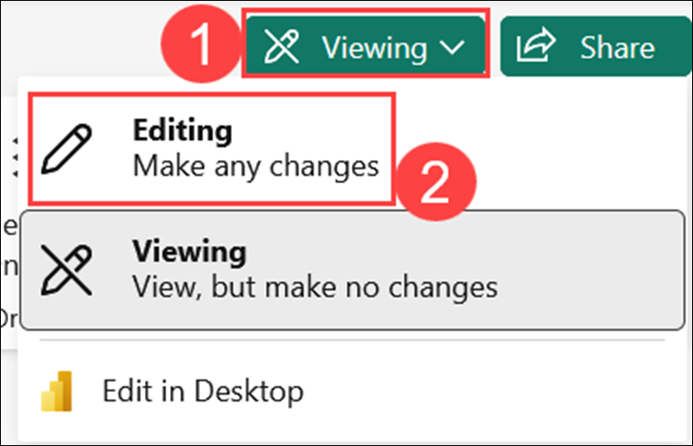

    > **Note**: Since this is the first time you've run any Spark code in this session, the Spark pool must be started. This means that the first run in the session can take a minute or so to complete. Subsequent runs will be quicker.

1. When the cell command has been completed, review the output below the cell, which should look similar to this:

    |Index|CustomerID|years_with_company|total_day_calls|total_eve_calls|total_night_calls|total_intl_calls|average_call_minutes|total_customer_service_calls|age|churn|
    | -- | -- | -- | -- | -- | -- | -- | -- | -- | -- | -- |
    |1|1000038|0|117|88|32|607|43.90625678|0.810828179|34|0|
    |2|1000183|1|164|102|22|40|49.82223317|0.294453889|35|0|
    |3|1000326|3|116|43|45|207|29.83377967|1.344657937|57|1|
    |4|1000340|0|92|24|11|37|31.61998183|0.124931779|34|0|
    | ... | ... | ... | ... | ... | ... | ... | ... | ... | ... | ... |

    The output shows the rows and columns of customer data from the churn.csv file.

## Task 4: Train a Machine Learning model

In this task, you will learn how to train a Machine Learning model in Microsoft Fabric using a dataset to make predictions and gain insights.

Now that you've loaded the data, you can use it to train a machine learning model and predict customer churn. You will train a model using the Scikit-Learn library and track the model with MLflow. 

1. Hover the mouse below the output sections and use the **+ Code** icon below the cell output to add a new code cell to the notebook.

   

1. Enter the following code in it. If the **+ Code** icon isn't visible, hover below the cell to make it appear :

    ```python
   from sklearn.model_selection import train_test_split

   print("Splitting data...")
   X, y = df[['years_with_company','total_day_calls','total_eve_calls','total_night_calls','total_intl_calls','average_call_minutes','total_customer_service_calls','age']].values, df['churn'].values
   
   X_train, X_test, y_train, y_test = train_test_split(X, y, test_size=0.30, random_state=0)
    ```

1. Run the code cell you added, and note you're omitting 'CustomerID' from the dataset, and splitting the data into a training and test dataset.

    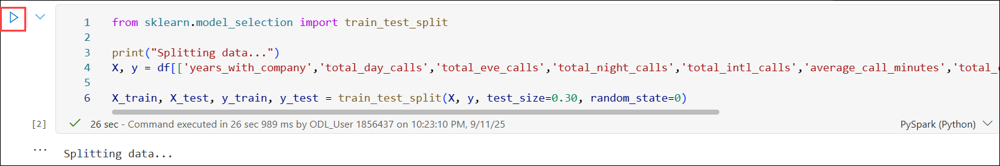
   
1. Add another new code cell to the notebook, enter the following code in it, and run the cell:
    
    ```python
   import mlflow
   experiment_name = "experiment-churn"
   mlflow.set_experiment(experiment_name)
    ```
    
    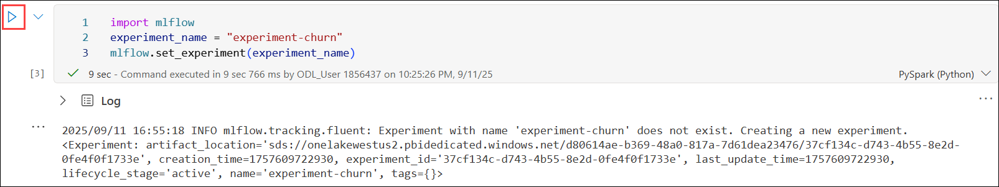

    The code creates an MLflow experiment named `experiment-churn`. Your models will be tracked in this experiment.   

1. Add another new code cell to the notebook, enter the following code in it, and run the cell:

    ```python
   from sklearn.linear_model import LogisticRegression
   
   with mlflow.start_run():
       mlflow.autolog()

       model = LogisticRegression(C=1/0.1, solver="liblinear").fit(X_train, y_train)

       mlflow.log_param("estimator", "LogisticRegression")
    ```
    
    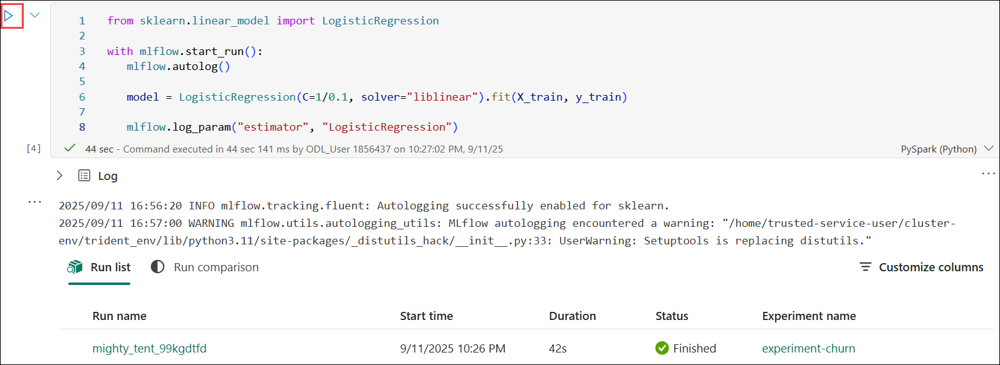

     The code trains a classification model using Logistic Regression. Parameters, metrics, and artifacts are automatically logged with MLflow. Additionally, you're logging a parameter called `estimator`, with the value `LogisticRegression`.

1. Add another new code cell to the notebook, enter the following code in it, and run the cell:

    ```python
   from sklearn.tree import DecisionTreeClassifier
   
   with mlflow.start_run():
       mlflow.autolog()

       model = DecisionTreeClassifier().fit(X_train, y_train)
   
       mlflow.log_param("estimator", "DecisionTreeClassifier")
    ```

    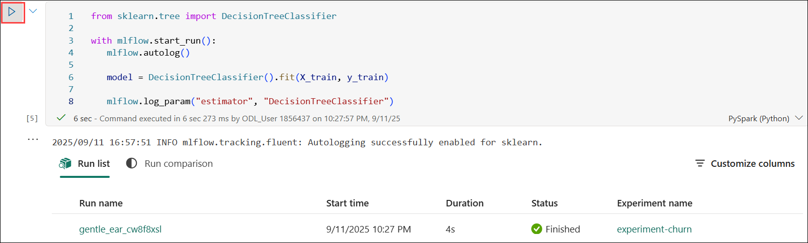

    The code trains a classification model using a Decision Tree Classifier. Parameters, metrics, and artifacts are automatically logged with MLflow. Additionally, you're logging a parameter called `estimator`, with the value `DecisionTreeClassifier`.

## Task 5: Use MLflow to search and view your experiments

You will learn how to use MLflow to search and view your machine learning experiments in Microsoft Fabric for tracking and managing model performance.

When you've trained and tracked models with MLflow, you can use the MLflow library to retrieve your experiments and their details.

1. Add another code cell to list all experiments, use the following code and run the cell:

    ```python
   import mlflow
   experiments = mlflow.search_experiments()
   for exp in experiments:
       print(exp.name)
    ```

   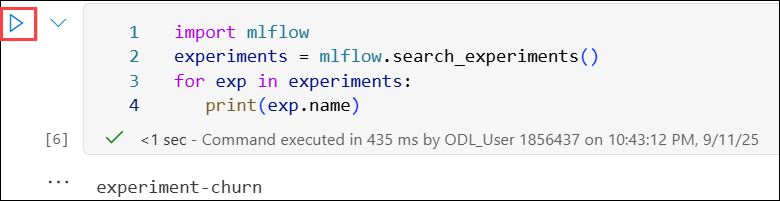

   This code retrieves and prints the names of all existing `MLflow experiments`.

1. Add a new cell to retrieve a specific experiment, you can get it by its name and run the cell:

    ```python
   experiment_name = "experiment-churn"
   exp = mlflow.get_experiment_by_name(experiment_name)
   print(exp)
    ```

    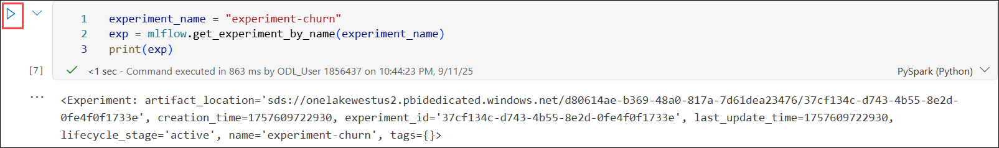

    This code fetches the details of a `specific experiment` using its name.

1. In the next cell using an experiment name, you can retrieve all jobs of that experiment by running the below code:

    ```python
   mlflow.search_runs(exp.experiment_id)
    ```

    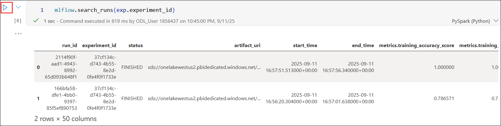

    This code displays all recorded runs under a given experiment.

1. To more easily compare job runs and outputs, you can configure the search to order the results. For example, the following cell orders the results by `start_time`, and only shows a maximum of `2` results. Add a new cell and run the below code:

    ```python
   mlflow.search_runs(exp.experiment_id, order_by=["start_time DESC"], max_results=2)
    ```

    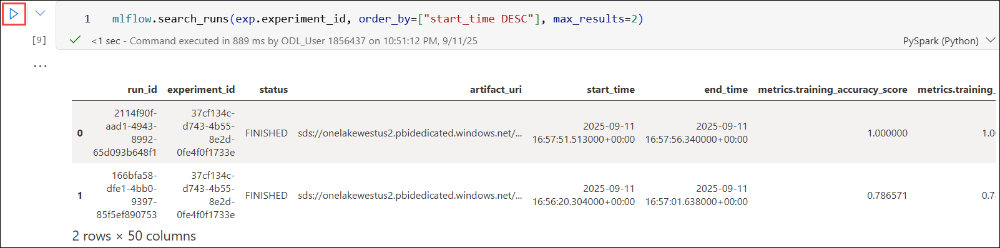

    This code displays retrieves the latest two runs sorted by start time in descending order.

1. Finally, you can plot the evaluation metrics of multiple models next to each other to easily compare models by executing the below code in a new cell:

    ```python
   import matplotlib.pyplot as plt
   
   df_results = mlflow.search_runs(exp.experiment_id, order_by=["start_time DESC"], max_results=2)[["metrics.training_accuracy_score", "params.estimator"]]
   
   fig, ax = plt.subplots()
   ax.bar(df_results["params.estimator"], df_results["metrics.training_accuracy_score"])
   ax.set_xlabel("Estimator")
   ax.set_ylabel("Accuracy")
   ax.set_title("Accuracy by Estimator")
   for i, v in enumerate(df_results["metrics.training_accuracy_score"]):
       ax.text(i, v, str(round(v, 2)), ha='center', va='bottom', fontweight='bold')
   plt.show()
    ```

    The output should resemble the following image:

    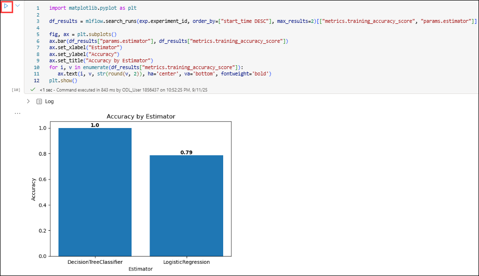

    This code visualizes and compares model accuracy scores using a bar chart.

## Task 6: Explore your experiments

Learn how to analyze performance metrics and gain insights from your machine learning experiments in Microsoft Fabric. Explore various tools and techniques to evaluate and optimize your models effectively.

Microsoft Fabric will keep track of all your experiments and allow you to visually explore them.

1. In the left panel, first click on **dp_fabric-<inject key="Deployment ID" enableCopy="false"/> (1)**, Select the `experiment-churn`**(2)** experiment to open it.

    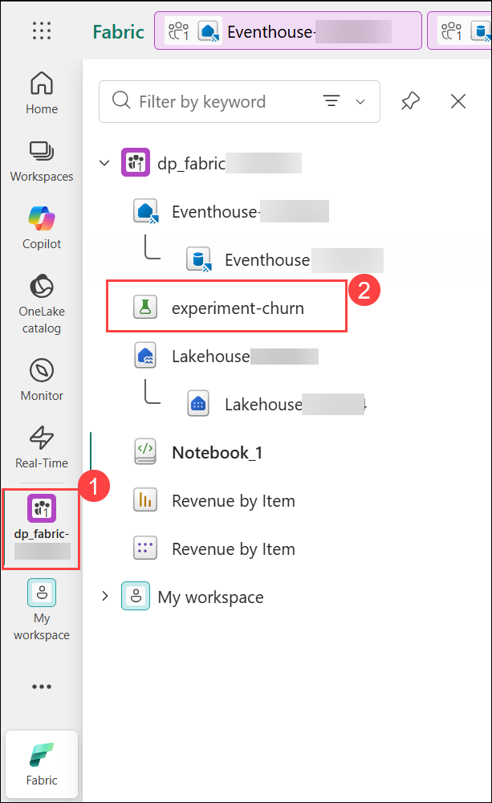

    > **Tip:** If you don't see any logged experiment runs, refresh the page.

1. On the pop-up, **Notebooks, Experiments, and ML models** select **Skip for now**.

    

1. Scroll down and Review the **Run metrics** to explore how accurate your regression model is.

    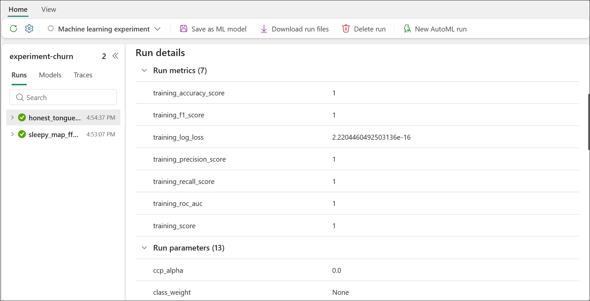

## Task 7: Save the model

In this task, you will learn how to save the trained Machine Learning model in Microsoft Fabric for future use and deployment.

After comparing machine learning models that you've trained across experiments, you can choose the best-performing model. To use the best-performing model, save the model and use it to generate predictions.

1. Select **Save as ML model** in the experiment ribbon.
   
   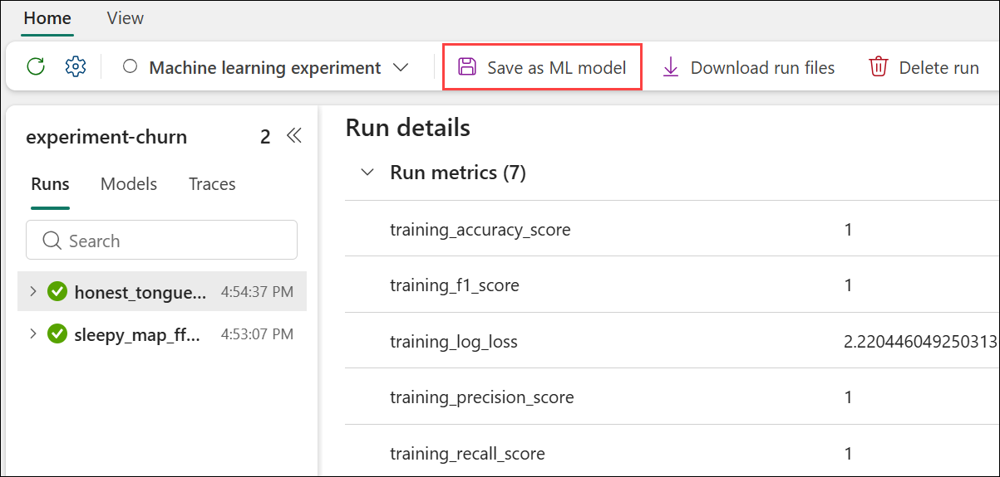

1. In the newly opened pop-up window, select **Create a new ML model**, then choose the `model` **(1)** folder. Enter **model-churn (2)** as the name and click **Save (3)**.

    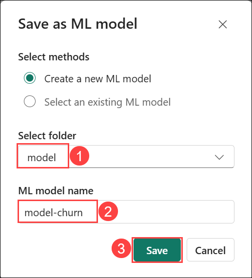

1. Select **View ML model** in the notification that appears at the top right of your screen when the model is created. You can also refresh the window. The saved model is linked under **ML model versions**.

   

Note that the model, the experiment, and the experiment run are linked, allowing you to review how the model is trained.

## Task 8: Save the Notebook and end the Spark session

In this task, you will discover how to preserve your work by saving the Notebook and efficiently ending the Spark session in Microsoft Fabric to free up resources.

Now that you've finished training and evaluating the models, you can save the notebook with a meaningful name and end the Spark session.

1. Navigate to **dp_fabric-<inject key="Deployment ID" enableCopy="false"/> (1)** workspace from the hub menu bar on the left and select **Notebook 1 (2)**.

    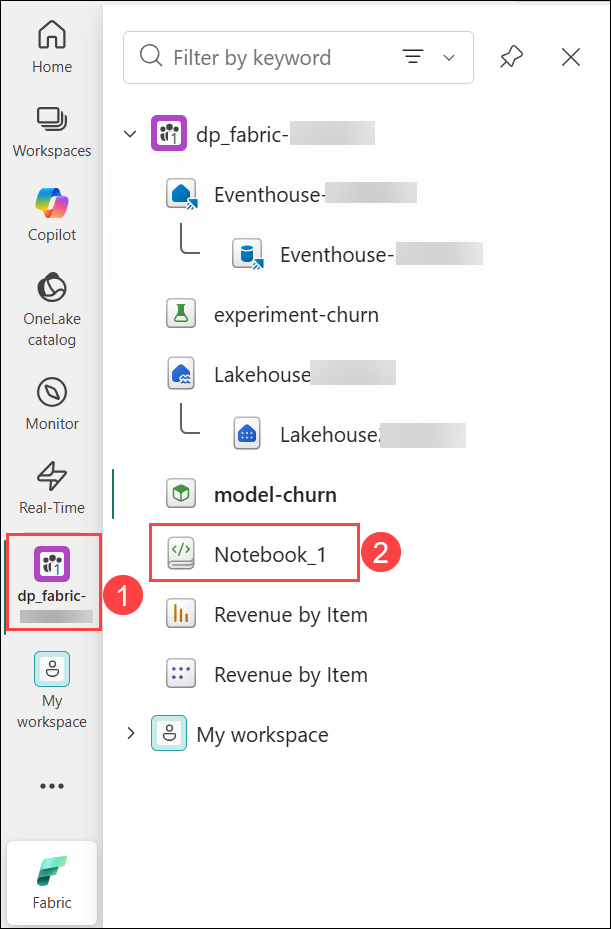

1. In the notebook menu bar, click the ⚙️ **Settings (1)** icon to open the notebook settings. Set the **Name** of the notebook to **Train and compare models (2)**, then **close (3)** the settings pane.

   

1. On the menu bar, click **Run (1)** tab, then select **Stop session (2)** to end the Spark session.

    

## Clean up resources

If you've finished exploring your model and experiments, you can delete the workspace you created for this exercise.

1. In the left panel, first click on **dp_fabric-<inject key="Deployment ID" enableCopy="false"/> (1)**, then select **dp_fabric-<inject key="Deployment ID" enableCopy="false"/> (2)** under the Filter by keyword section.

   

1. From the top right corner, click on **Workspace settings**.

   

1. In the **General (1)** section, scroll down and select **Remove this workspace (2)**.

    

1. In the **Delete workspace** pop-up, click **Delete**.

   

## Summary:

In this lab, you have learned how to set up a data science workflow in Microsoft Fabric. You created a Lakehouse, uploaded data, and used Notebooks to explore and preprocess the data. You trained a machine learning model, tracked experiments using MLflow, and saved both the model and the Notebook. This hands-on experience demonstrated how Microsoft Fabric streamlines data science and AI development.

You have completed the following tasks:

- Created a Lakehouse and uploaded files
- Created a Notebook
- Loaded data into a dataframe
- Trained a Machine Learning model
- Used MLflow to search and view your experiments
- Explored your experiments
- Saved the model
- Saved the Notebook and ended the Spark session

## References:
- [Microsoft Learn](https://learn.microsoft.com)
- [Microsoft Fabric Documentation](https://learn.microsoft.com/en-us/fabric/)
- [Azure Machine Learning Documentation](https://learn.microsoft.com/en-us/azure/machine-learning/)

## Congratulations! You have successfully completed this lab.

By completing this **Get Started with Real-Time Analytics and Data Science with Microsoft Fabric** hands-on lab, you learned to use Microsoft Fabric for real-time analytics and data science. You ingested and queried streaming data with KQL, visualized insights in Power BI, and built machine-learning models with Python and MLflow. This end-to-end process equips you to turn live data into actionable insights for faster, smarter decisions.
